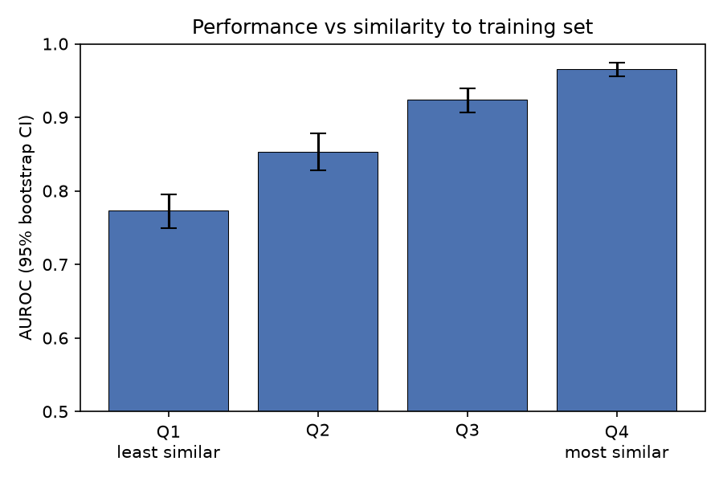

# Blood-Brain Barrier Permeability: A Re-evaluation of the BBB_Martins Benchmark

Independent computational project examining what a single headline AUROC
conceals about representation, chemical novelty and label quality on a
standard ADMET benchmark.

**Full report:** [report.pdf](report.pdf)

## Findings

**1. Fingerprints beat four textbook descriptors, but not by much.**
A 2,048-bit Morgan fingerprint random forest reached AUROC 0.903 (SD 0.026).
Logistic regression on molecular weight, logP, TPSA and hydrogen-bond donor
count reached 0.850 (SD 0.035). Mean paired difference +0.053
(95% CI 0.038–0.068, p < 0.0001, n = 20 scaffold splits). The four-descriptor
model recovers roughly 87% of the fingerprint model's improvement over chance.

**2. Performance depends heavily on how novel the test chemistry is.**
Pooling 8,120 predictions and stratifying by maximum Tanimoto similarity to
the training set:

| Quartile | Similarity | AUROC | 95% CI |
| --- | --- | --- | --- |
| Least similar | 0.04–0.31 | 0.773 | 0.749–0.795 |
| | 0.31–0.45 | 0.853 | 0.828–0.878 |
| | 0.45–0.60 | 0.924 | 0.907–0.939 |
| Most similar | 0.60–1.00 | 0.965 | 0.955–0.974 |

Monotonic, non-overlapping intervals, spanning 0.192 AUROC. Not explained by
class balance — the best-performing quartile had the *lowest* positive
prevalence. A headline figure near 0.90 is an average across this range.

**3. About 1% of labels contradict themselves, for two different reasons.**
Ten structures carry both labels. Six are curation artefacts (`Miconazole`
and `miconazole` filed as separate entries with opposite labels). The rest
reflect pharmacology a binary label cannot express: loperamide crosses the
endothelium but is effluxed by P-glycoprotein; levodopa is too polar for
passive diffusion but enters via LAT1 carrier-mediated transport.



## Reproducing

```bash
conda env create -f environment.yml
conda activate bbb
python bbb_step1.py
python bbb_step2.py
python bbb_step3.py
python bbb_step4.py
```

Runs on CPU. Total runtime under 30 minutes on a consumer laptop.

If the pip step fails on PyTDC, install it separately — later versions of its
dependency tree include a package with no Windows distribution:

```bash
pip install PyTDC==0.4.1 --no-deps
pip install fuzzywuzzy tqdm seaborn requests huggingface_hub
```

On Windows 11 with Smart App Control enabled, pip-installed packages with
compiled extensions may be blocked at import. Installing them from
conda-forge resolves this.

## Contents

| File | Purpose |
| --- | --- |
| `bbb_step1.py` | Data loading, inspection, baseline random forest under scaffold split |
| `bbb_step2.py` | Label quality, descriptor model, median similarity split |
| `bbb_step3.py` | Twenty-split evaluation, paired testing, quartile stratification, figures |
| `bbb_step4.py` | Descriptor collinearity, named per-molecule predictions, near-identical pairs |
| `results_per_seed.csv` | AUROC for both models, per seed, with median similarity |
| `results_per_molecule.csv` | Every test prediction with label and nearest-neighbour similarity |
| `results_per_molecule_named.csv` | As above, with entry identifier and nearest-neighbour identity |
| `results_by_quartile.csv` | Quartile AUROCs with bootstrap intervals |
| `results_descriptor_collinearity.csv` | Per-descriptor R² and variance inflation factors |
| `results_similarity_anomalies.csv` | Test–train pairs with Tanimoto similarity ≥ 0.99 |
| `environment.yml` | Pinned conda environment |
| `requirements.txt` | Pinned pip packages as installed for the analysis |

## Method notes

- **Scaffold splitting** via TDC's `get_split(method='scaffold')`, which
  assigns whole Bemis–Murcko scaffold groups to partitions. 70:10:20,
  1,421 train and 406 test molecules.
- **Deviation from the official TDC protocol:** the Benchmark Group fixes the
  test partition and reshuffles only train and validation. Here the entire
  split is resampled per seed, so these numbers are *not* directly comparable
  to leaderboard entries. The trade-off buys a measurement of sensitivity to
  scaffold assignment, which a fixed test partition cannot provide.
- **AUROC over accuracy** because the majority class is 76.4%. **AUROC over
  AUPRC** because the positive class is the majority, putting the AUPRC
  chance baseline at 0.764.
- **Paired testing** throughout: both models see identical splits at each
  seed, so split-to-split variance is differenced out.
- **No hyperparameter tuning** on either model. Both use library defaults.

## Known limitations

Single dataset and endpoint, no external validation. Similarity is measured
with the same fingerprint the model consumes, and that measure saturates —
cyclopropane and cyclohexane return a Tanimoto of 1.000 because radius-2
environments cannot resolve ring size. The four descriptors are collinear
(TPSA VIF 10.09), so individual coefficients are not independently
interpretable. Duplicates were identified by exact SMILES match without
structure standardisation, which underestimates their true number.

## Data

Martins et al. blood–brain barrier penetration dataset, accessed via
[Therapeutics Data Commons](https://tdcommons.ai/). 2,030 rows, 1,975 unique
structures, 76.4% positive.

## Author

Ryan Yeung — MPharm, UCL School of Pharmacy

An AI assistant was used for environment configuration, drafting the analysis
scripts, and manuscript review; see the acknowledgements section of the report
and [CLAUDE.md](CLAUDE.md).